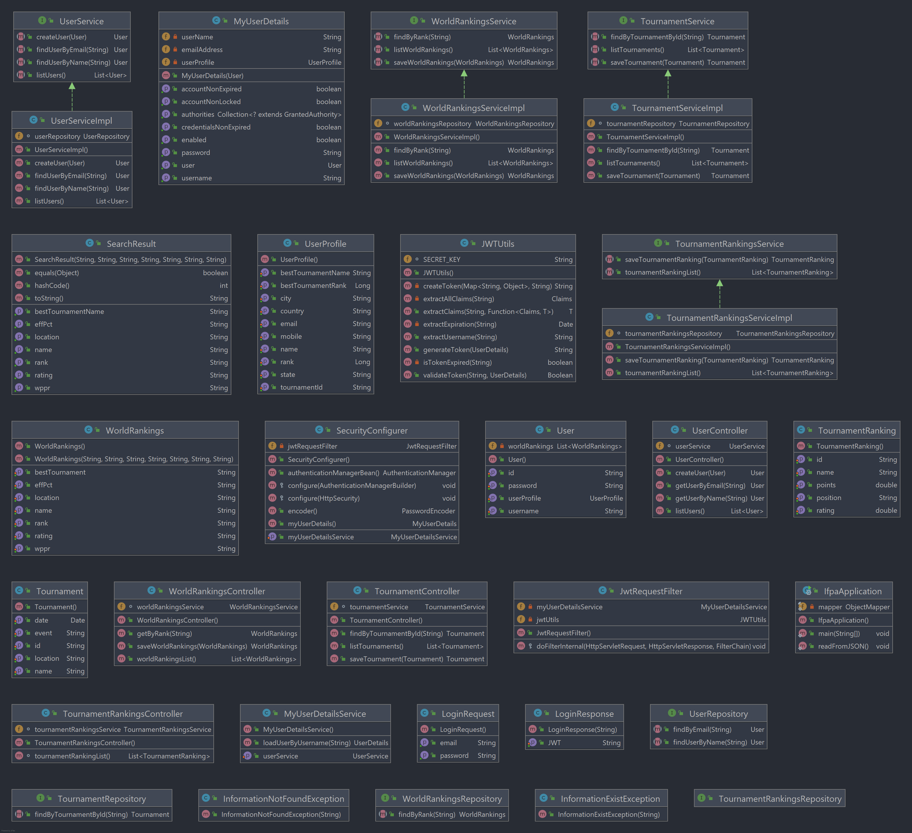

# International Flipper Pinball Association

**User Stories -**  

**Bronze level:** 

* As a user I want to be able to create an account with the IFPA 

* As a user I want to be able to login to my account 

* As a user I want to be able to view my profile 

* As a user I want to be able to view other players’ profiles 

* As a user I want to be able to view my stats 

* As a user I want to be able to view other players’ stats 

* As a user I want to be able to see my ranking 

* As a user I want to be able to see the ranking of other players 

**Silver level:** 

* As a user I want to be able to view individual tournament results 

* As a user I want to be able to view upcoming tournaments 

**Gold level:** 

* As a user I want to be able to sign up for upcoming tournaments 

* As a user I want to be able to link my personal profile my public profile on the site 

**Platinum level:** 

* As an admin I want to be able to update results from tournaments 

* As an admin I want to be able to add upcoming tournaments 

### Resources
[Web Scraping Tutorial](https://zenscrape.com/java-web-scraping-comprehensive-tutorial/)  
We first tried a simple jsoup crawler on [Books to Scrape](http://books.toscrape.com/index.html). The jsoup method successfully returned the endpoints and titles of the books on the home page. We decided to comment this code out and try the HtmlUnit because it allows us to block CSS and JavaScript to help simplify getting a website's data.  

We explored both options in the tutorial and found we understood the HtmlUnit method better. We removed the jsoup code that we tested scraping different types of data:  
>       
        
        Document page = Jsoup.connect("http://books.toscrape.com/index.html").get();

        //selecting all hyperlinks
        Elements pageElements = page.select("a[href]");

        ArrayList<String> hyperLinks = new ArrayList<String>();

        //iterating and extracting
        for (Element e:pageElements) {
            hyperLinks.add("Text: " + e.text());
            hyperLinks.add("Link: " + e.attr("href"));
        }

        for (String s : hyperLinks) {
            System.out.println(s);

        java.util.logging.Logger.getLogger("com.gargoylesoftware.htmlunit").setLevel(java.util.logging.Level.OFF);
        java.util.logging.Logger.getLogger("org.apache.http").setLevel(java.util.logging.Level.OFF);

[Udemy: Professional Scraping with Java](https://www.udemy.com/course/learn-web-scraping-with-java-in-just-1-hour/)

[Stackoverflow](stackoverflow.com)

[Scraping Bee: Introduction to Web Scraping with Java](https://www.scrapingbee.com/blog/introduction-to-web-scraping-with-java/)

[How to Convert CSV to JSON in Java](https://dzone.com/articles/how-to-convert-csv-to-json-in-java)

We then created a class to set up a plain old Java object (POJO) to convert the data to a JSON file.  We did find success in doing this, however it became clear very quickly that pushing that data to MongoDb was going to be a difficult task. Originally we thought we could push the scraped data directly to the database. There is potentially a way to do this, however we were unable to figure it out. The data may also not have been formatted properly if we had done that. Since we were pulling a data table from the site, it seems that scraping to a CSV file and then converting to a Json file was the only way we could ensure that the data would be formatted properly. After quite a bit of research and failed attempts, we did have to reach out for help with pushing the data to MongoDb. We still need to write out the code to schedule how often the program scrapes from the website, as well as the "next page" function to get all of the data. We stuck with 500 entries during build and testing as there are over 81,000 entries and we didn't feel it necessary to pull that much data at this time. Future plans would also include extending the scraper to retrieve data from the other parts of the site. 

>

     public class SearchResult {

    private final String rank;
    private final String name;
    private final String location;
    private final String wppr;
    private final String rating;
    private final String effPct;
    private final String bestTournamentName;

    public SearchResult(String rank, String name, String location, String wppr, String rating, String effPct, String bestTournamentName) {
        this.rank = rank;
        this.name = name;
        this.location = location;
        this.wppr = wppr;
        this.rating = rating;
        this.effPct = effPct;
        this.bestTournamentName = bestTournamentName;
    }

    public String getRank() {
        return rank;
    }

    public String getName() {
        return name;
    }

    public String getLocation() {
        return location;
    }

    public String getWppr() {
        return wppr;
    }

    public String getRating() {
        return rating;
    }

    public String getEffPct() {
        return effPct;
    }

    public String getBestTournamentName() {
        return bestTournamentName;
    }

    @Override
    public boolean equals(Object o) {
        if (this == o) return true;
        if (!(o instanceof SearchResult)) return false;
        SearchResult that = (SearchResult) o;
        return rank.equals(that.rank) && name.equals(that.name) && location.equals(that.location) && wppr.equals(that.wppr) && rating.equals(that.rating) && effPct.equals(that.effPct) && bestTournamentName.equals(that.bestTournamentName);
    }

    @Override
    public int hashCode() {
        return Objects.hash(rank, name, location, wppr, rating, effPct, bestTournamentName);
    }

    @Override
    public String toString() {
        return "SearchResult{" +
                "rank='" + rank + '\'' +
                ", name='" + name + '\'' +
                ", location='" + location + '\'' +
                ", wppr='" + wppr + '\'' +
                ", rating='" + rating + '\'' +
                ", effPct='" + effPct + '\'' +
                ", bestTournamentName='" + bestTournamentName + '\'' +
                '}';
        }
    }
    
   
        
 >      
          HtmlTable searchResult = (HtmlTable) page.getByXPath("//table[@class='table table-striped table-hover table-sm']").get(0);

                final String rank = searchResult.asText();
                final String name = searchResult.asText();
                final String location = searchResult.asText();
                final String wppr = searchResult.asText();
                final String rating = searchResult.asText();
                final String effPct = searchResult.asText();
                final String bestTournamentName = searchResult.asText();

                resultList.add((new SearchResult(rank, name, location, wppr, rating, effPct, bestTournamentName)));
            System.out.println(attributes.asText());
            mapper.writerWithDefaultPrettyPrinter().writeValue(new File("results.json"), resultList);
            } catch(Exception e){
                e.printStackTrace();
            }
    }  
    

Reviewing the site indicates that there is currently not a way to sign up for the site outside of emailing the admins. Even doing this would not link your account to your player profile by design. This would be something to potentially build out in future versions. We did build out the program to handle the other aspects of the site we are pulling from, however the unexpected time consumption of building a working scraper, formating the data properly, and then commiting to the DB prevented us from implementing those parts at this time. While the amount of research and failed attempts were extremely frustrating and time consuming, we both found it to be beneficial as a learning experience. 
    
     
   
    
### ERD Diagram

## HTTP Path Mappings
| **HTTP REQUEST** | **PATH** | **DESCRIPTION** |
| ---------------- | -------- | --------------- |
| GET | /api/world_rankings/ | Retrieve all rankings |  
| PUT | /api/world_rankings/ | Update all rankings |  

