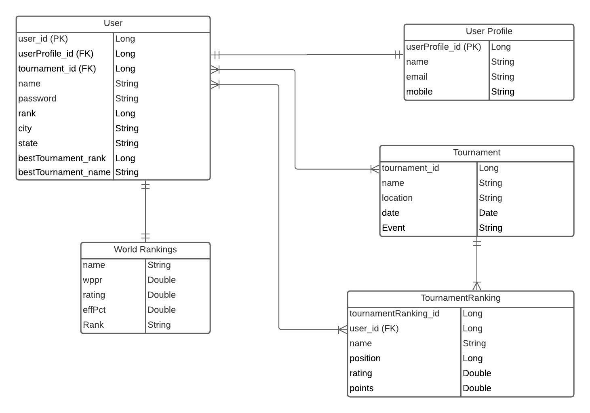

# ifpa

### Resources
[Web Scraping Tutorial](https://zenscrape.com/java-web-scraping-comprehensive-tutorial/)  
We first tried a simple jsoup crawler on [Books to Scrape](http://books.toscrape.com/index.html). The jsoup method successfully returned the endpoints and titles of the books on the home page. We decided to comment this code out and try the HtmlUnit because it allows us to block CSS and JavaScript to help simplify getting a website's data.  

We explored both options in the tutorial and found we understood the HtmlUnit method better. We removed the jsoup code that we tested scraping different types of data:  
>       
        Document page = Jsoup.connect("http://books.toscrape.com/index.html").get();

        //selecting all hyperlinks
        Elements pageElements = page.select("a[href]");

        ArrayList<String> hyperLinks = new ArrayList<String>();

        //iterating and extracting
        for (Element e:pageElements) {
            hyperLinks.add("Text: " + e.text());
            hyperLinks.add("Link: " + e.attr("href"));
        }

        for (String s : hyperLinks) {
            System.out.println(s);

        java.util.logging.Logger.getLogger("com.gargoylesoftware.htmlunit").setLevel(java.util.logging.Level.OFF);
        java.util.logging.Logger.getLogger("org.apache.http").setLevel(java.util.logging.Level.OFF);

[Udemy: Professional Scraping with Java](https://www.udemy.com/course/learn-web-scraping-with-java-in-just-1-hour/)

[Stackoverflow](stackoverflow.com)

[Scraping Bee: Introduction to Web Scraping with Java](https://www.scrapingbee.com/blog/introduction-to-web-scraping-with-java/)

>

public class SearchResult {

    private final String rank;
    private final String name;
    private final String location;
    private final String wppr;
    private final String rating;
    private final String effPct;
    private final String bestTournamentName;

    public SearchResult(String rank, String name, String location, String wppr, String rating, String effPct, String bestTournamentName) {
        this.rank = rank;
        this.name = name;
        this.location = location;
        this.wppr = wppr;
        this.rating = rating;
        this.effPct = effPct;
        this.bestTournamentName = bestTournamentName;
    }

    public String getRank() {
        return rank;
    }

    public String getName() {
        return name;
    }

    public String getLocation() {
        return location;
    }

    public String getWppr() {
        return wppr;
    }

    public String getRating() {
        return rating;
    }

    public String getEffPct() {
        return effPct;
    }

    public String getBestTournamentName() {
        return bestTournamentName;
    }

    @Override
    public boolean equals(Object o) {
        if (this == o) return true;
        if (!(o instanceof SearchResult)) return false;
        SearchResult that = (SearchResult) o;
        return rank.equals(that.rank) && name.equals(that.name) && location.equals(that.location) && wppr.equals(that.wppr) && rating.equals(that.rating) && effPct.equals(that.effPct) && bestTournamentName.equals(that.bestTournamentName);
    }

    @Override
    public int hashCode() {
        return Objects.hash(rank, name, location, wppr, rating, effPct, bestTournamentName);
    }

    @Override
    public String toString() {
        return "SearchResult{" +
                "rank='" + rank + '\'' +
                ", name='" + name + '\'' +
                ", location='" + location + '\'' +
                ", wppr='" + wppr + '\'' +
                ", rating='" + rating + '\'' +
                ", effPct='" + effPct + '\'' +
                ", bestTournamentName='" + bestTournamentName + '\'' +
                '}';
    }
}  

>

 HtmlTable searchResult = (HtmlTable) page.getByXPath("//table[@class='table table-striped table-hover table-sm']").get(0);

                final String rank = searchResult.asText();
                final String name = searchResult.asText();
                final String location = searchResult.asText();
                final String wppr = searchResult.asText();
                final String rating = searchResult.asText();
                final String effPct = searchResult.asText();
                final String bestTournamentName = searchResult.asText();

                resultList.add((new SearchResult(rank, name, location, wppr, rating, effPct, bestTournamentName)));
//                System.out.println(attributes.asText());
            mapper.writerWithDefaultPrettyPrinter().writeValue(new File("results.json"), resultList);
            } catch(Exception e){
                e.printStackTrace();
            }

    }  
### ERD Diagram

